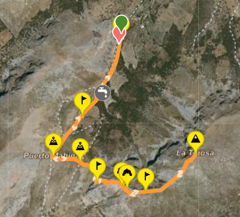

# Subida a La Tiñosa

La Tiñosa es el pico más alto de la provincia de Córdoba, con una altitud de 2,428 metros. Esta subida es una de las más populares entre los amantes del senderismo y ofrece vistas espectaculares.

## Información General

- **Ubicación:** Sierra de Cabra, Córdoba
- **Dificultad:** Moderada
- **Duración aproximada:** 4-6 horas
- **Distancia:** 12 km (ida y vuelta)

## Descripción de la Ruta

La ruta comienza en el **Centro de Visitantes** de la Sierra de Cabra. Desde allí, seguirás un sendero bien marcado que te llevará a través de paisajes de pinos y encinas. A medida que asciendas, disfrutarás de vistas panorámicas de la sierra y los valles circundantes.

### Puntos de interés

1. **Mirador de la Tiñosa:** Un excelente lugar para hacer una pausa y disfrutar del paisaje.
2. **Cruz de La Tiñosa:** Un emblemático hito en la cima que marca el punto más alto.
3. **Fauna y Flora:** Observa especies autóctonas como el buitre leonado y la jara.

## Recomendaciones

- Lleva suficiente agua y comida.
- Usa calzado adecuado para senderismo.
- Comprueba la previsión meteorológica antes de salir.

## Foto
 

## Webgrafía

Para más información sobre la ruta y detalles adicionales, puedes visitar:

- [Wikiloc - Ruta a La Tiñosa](https://www.wikiloc.com/rutas-senderismo/la-tinosa-19293535)

---

¡Disfruta de la aventura y de las impresionantes vistas en la cima de La Tiñosa!
